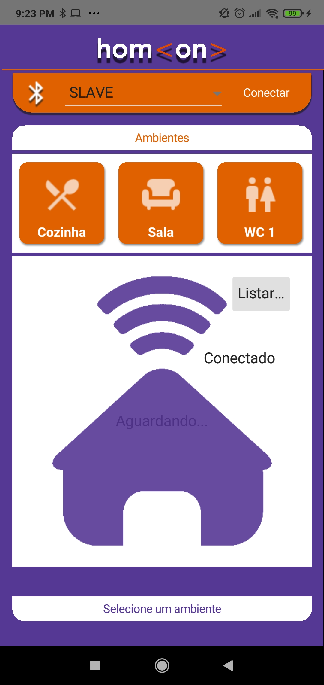

# 🏠 hom\<on> — Smart Home Automation

> Projeto de automação residencial desenvolvido durante o curso técnico na **ETEC**, integrando um aplicativo mobile com hardware Arduino via Bluetooth para simular o controle inteligente de uma residência.

---

## 📱 Interface do Aplicativo

O app **hom\<on>** foi desenvolvido em **Delphi (FireMonkey)** para Android e apresenta uma interface intuitiva com botões por ambiente, seleção de dispositivo Bluetooth e feedback visual do estado da conexão.

">

### Ambientes controlados pelo app:
| Ícone | Ambiente |
|:---:|---|
| 🍴 | Cozinha |
| 🛋️ | Sala |
| 🛏️ | Dormitório 1 |
| 🚻 | Banheiro (WC) |
| 🚗 | Garagem |

---

## ⚙️ Arquitetura do Sistema

```
[ App hom<on> ] → Bluetooth → [ Arduino ] → [ Dispositivos físicos ]
                                               ├── LEDs (iluminação)
                                               ├── Servo Motor
                                               ├── Sensor Laser
                                               └── Caixa de som
```

O sistema opera em três camadas:

1. **Interface** — App mobile com seleção de ambientes e controle por botões
2. **Comunicação** — Conexão Bluetooth via módulo HC-05
3. **Controle físico** — Arduino interpreta comandos e aciona os dispositivos

---

## 🛠️ Tecnologias Utilizadas

### Software
| Ferramenta | Uso |
|---|---|
| Delphi / FireMonkey | Desenvolvimento do app mobile (Android) |
| Object Pascal | Linguagem de programação |
| Arduino IDE / C++ | Programação do microcontrolador |
| Bluetooth Classic | Comunicação app ↔ Arduino |

### Hardware
| Componente | Função |
|---|---|
| Arduino | Microcontrolador central |
| Módulo Bluetooth HC-05 | Comunicação sem fio |
| LEDs (10x) | Simulação de iluminação por ambiente |
| Servo Motor | Controle de abertura (porta/garagem) |
| Sensor Laser | Detecção de presença |
| Caixa de som | Simulação de eventos sonoros |
| LDR | Sensor de luminosidade para automação externa |

---

## ✅ Funcionalidades

- [x] Conexão Bluetooth com o Arduino via app
- [x] Controle de iluminação por ambiente
- [x] Automação da iluminação externa com sensor LDR
- [x] Acionamento de servo motor
- [x] Simulação de presença na residência
- [x] Interface gráfica com seleção de ambientes
- [x] Feedback visual de status da conexão

---

## 📁 Estrutura do Repositório

```
smart-home-automation/
│
├── 📱 APP mobile/          # Aplicativo Android (Delphi/FMX)
│   ├── Unit1.pas           # Tela principal e lógica do app
│   ├── BTConfig.pas        # Configuração Bluetooth
│   └── Remote.dproj        # Projeto Delphi
│
├── 🤖 Arduino/             # Código do microcontrolador
│   ├── iluminacao.ino      # Controle de iluminação e LDR
│   └── ...
│
└── 📄 README.md
```

---

## 📚 Conceitos Aplicados

- Automação residencial e IoT
- Comunicação Bluetooth entre dispositivos
- Programação embarcada (Arduino / C++)
- Desenvolvimento de app mobile (Delphi / FireMonkey)
- Integração hardware-software
- Sensores analógicos e controle de atuadores

---

## 🚀 Melhorias Futuras

- [ ] Migração para controle via Wi-Fi / MQTT (IoT)
- [ ] Reescrita do app em Flutter ou React Native
- [ ] Dashboard web para monitoramento em tempo real
- [ ] Adição de mais sensores (temperatura, presença PIR)
- [ ] Automações baseadas em horário e rotinas

---

## 👨‍💻 Autor

**Bruno Neemias**
Projeto desenvolvido para fins educacionais como parte das atividades do curso técnico na **ETEC**, aplicando conceitos de automação, sistemas embarcados e integração de hardware e software.

[](https://github.com/brunoneemias)

---

> 💡 Este repositório reúne os módulos do projeto **hom\<on>**, um sistema de automação residencial com foco em aprendizado prático de IoT e integração de sistemas.
